# LAB 26 
this includes a home page an add task and all task page with some functionality when the add task button is clicked.

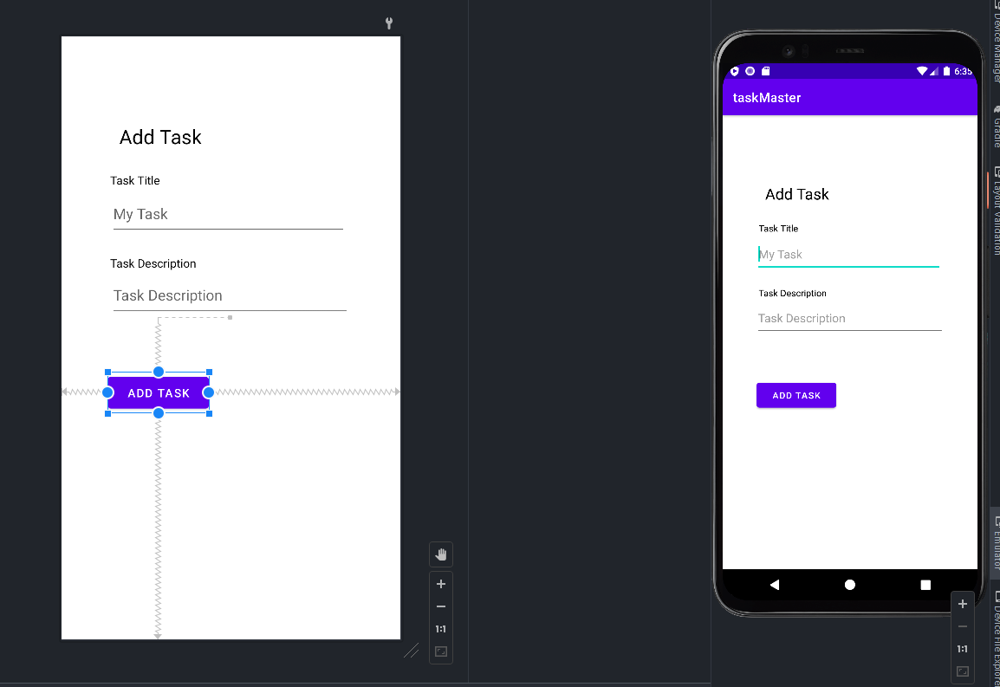
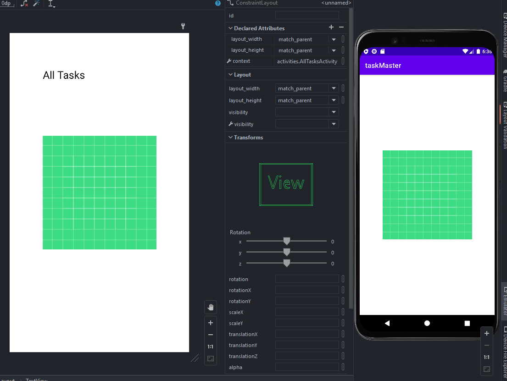
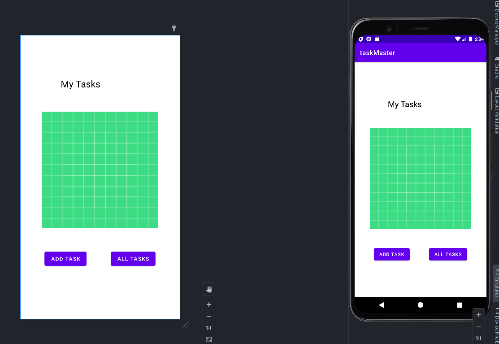

## LAB 27 

added a task details page as well as a settings page.
the settings page allows the user to set their username which displays on the home page it is saved in local storage
the home page now has three task buttons that when clicked on bring you to the task page where it updates the title for the respective task

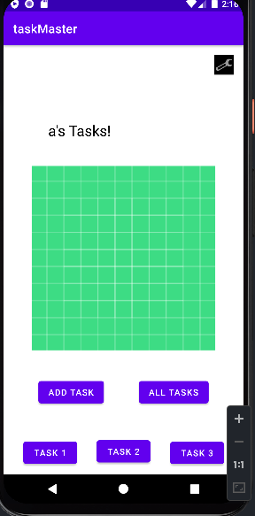
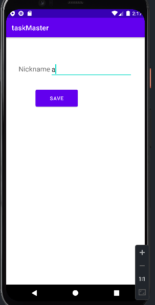
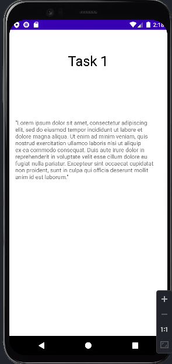
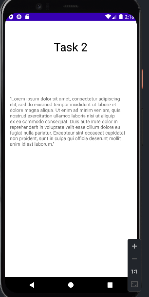
Task three works the same I just didn't take a screen shot

## Lab 28 

added recycler view and the ability to click on each 
task and then be brought to the task details page. 
Also added in task status to differentiate the different states of the tasks. 
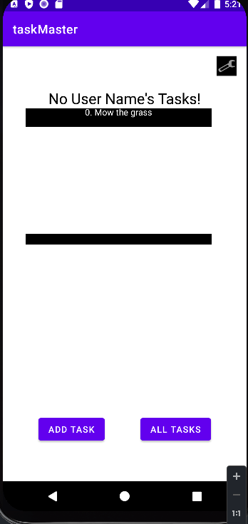

## Lab 29
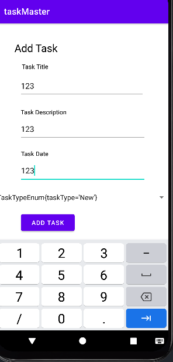
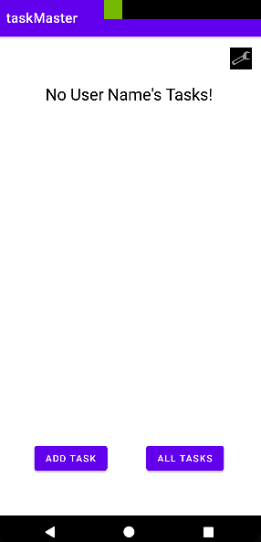
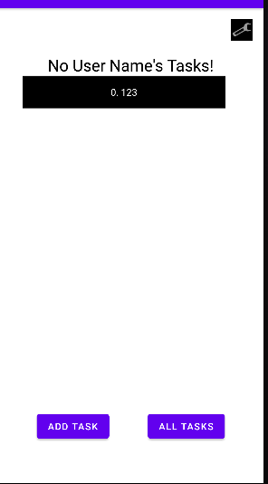
added the ability to add tasks to the database and then for those tasks to populate on the home page.

## Lab 30
added three espresso tests

## Lab 31
added amplify to application, data is now stored via AWS Dynamo DB. We have the date posted via DynamoDB status. 
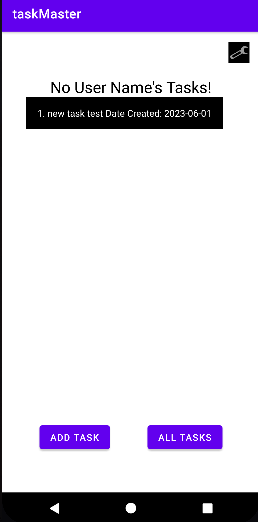

## Lab 33
added many to one relationship
added expresso test for new functionality. 
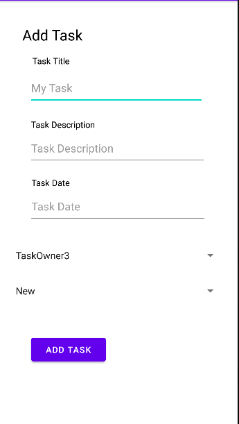
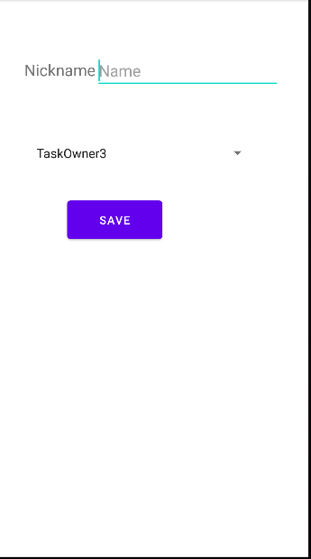

## lab 34
unable to finish todays lab because google has to verify my identity first. screenshot to show all other errors are gone. 
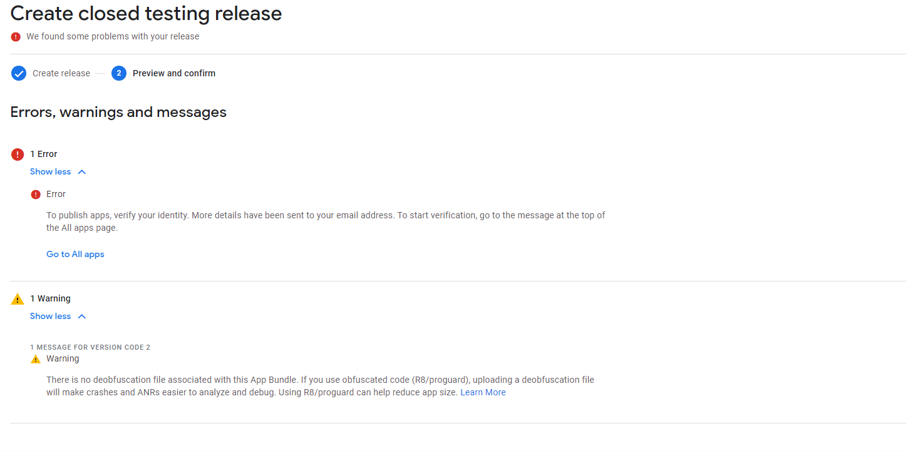
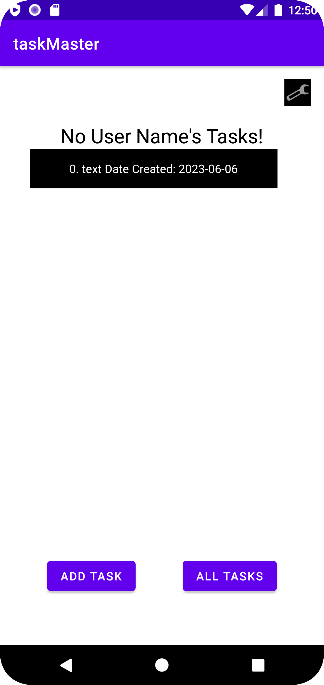
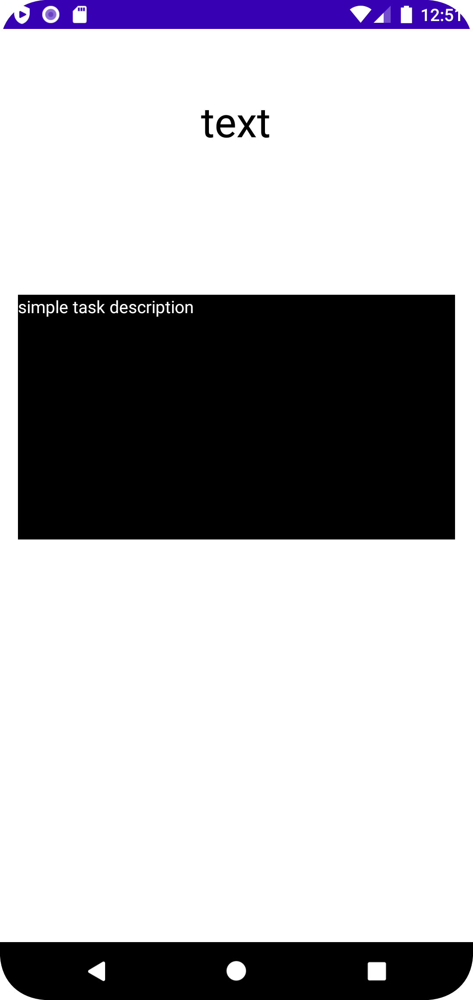

## Lab 35
unable to test todays lab as I keep getting errors with AWS auth. here is my error code for reference, 
The error occurs after putting in the code that was sent to my email for signup. 
verification failed: UnknownException{message=Confirm sign up failed., cause=java.net.SocketTimeoutException: failed to connect to cognito-idp.us-east-2.amazonaws.com/2600:1f16:9b9:9601:f915:379c:afbc:6628 (port 443) from /fec0::458:37b7:934a:2b94 (port 46866) after 2000ms, recoverySuggestion=Sorry, we don't have a suggested fix for this error yet.}

fixed the lab implemented the login logout functionality. 
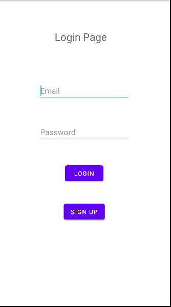
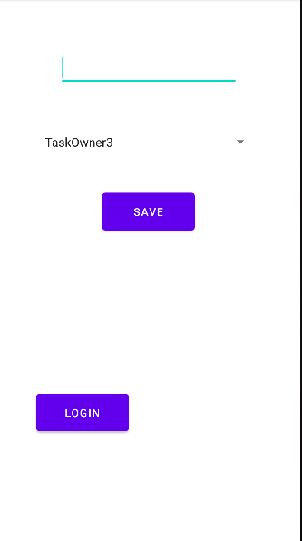
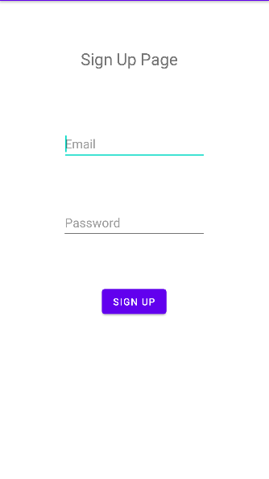

## Lab 36
added the ability to add photos to new tasks! struggled implementing the viewing of the photos
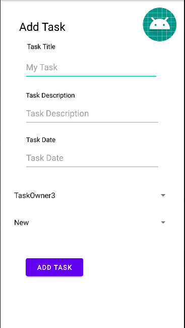

## Lab 37
added the ability to add lat and lon also finished previous lab. I am missing the displaying of the lat and lon currently
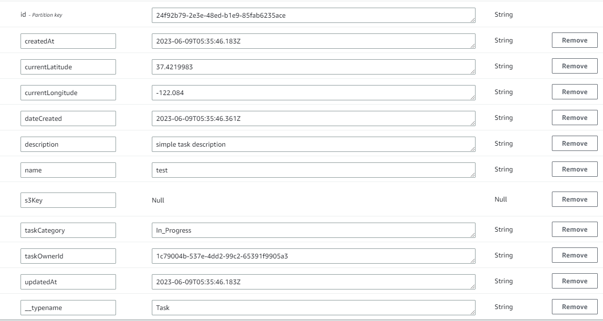

## Lab 41
added the ability for text to speech as well as the translation of text
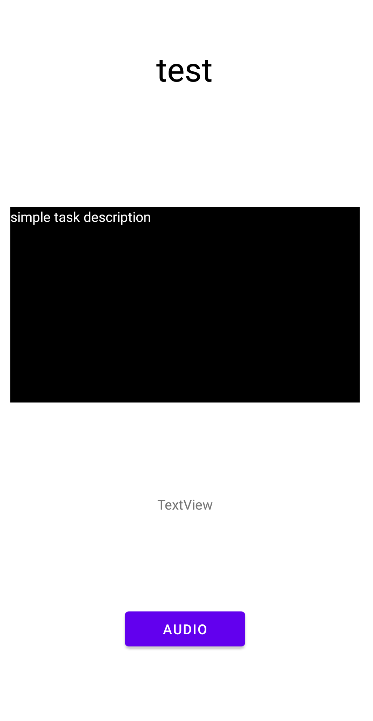